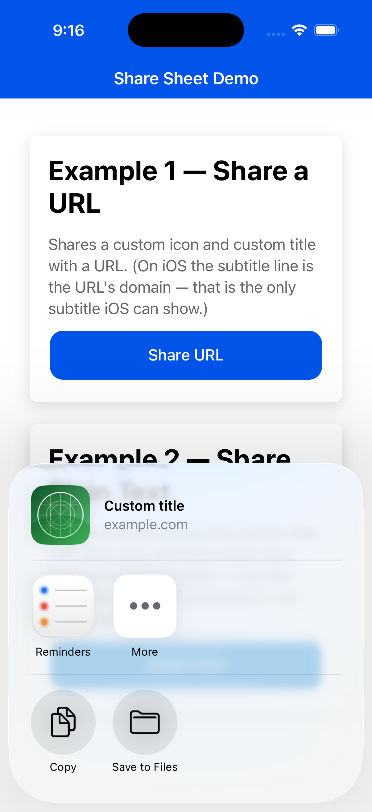
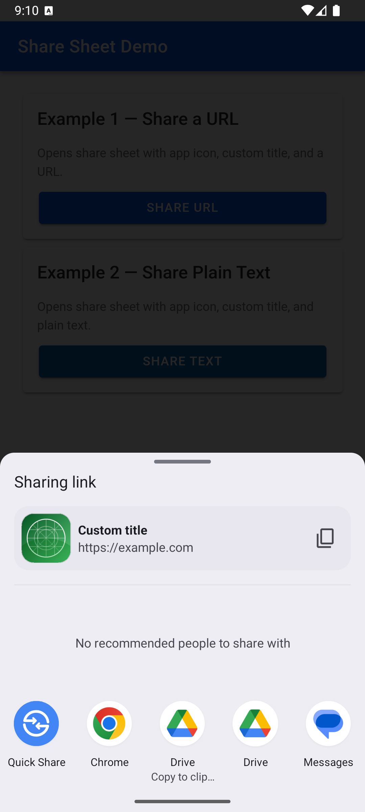
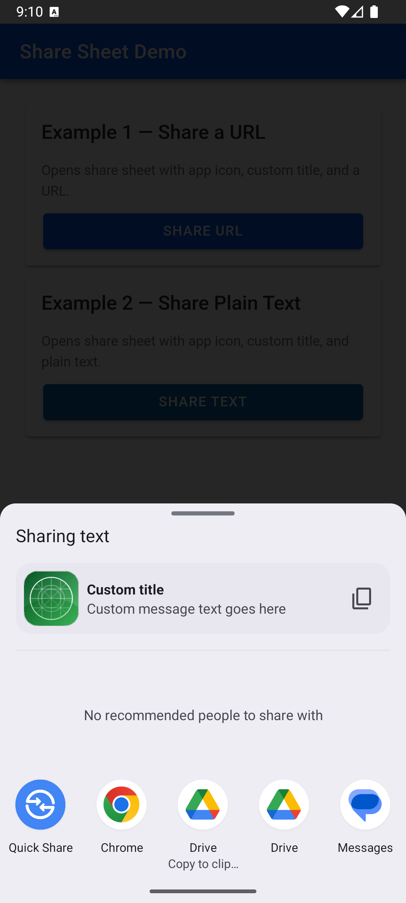

# Ionic Custom Share Sheet Demo

Ionic 8 + Angular 20 + **Capacitor 7** app demonstrating a custom native share sheet with
an app icon and title in the preview, on both iOS and Android.

> This is the **Capacitor 7** branch. iOS uses CocoaPods (Cap 7 default). The plugin code
> is identical to the Capacitor 8 version on `main` — only the native project scaffold
> differs (CocoaPods vs Swift Package Manager).

## Features

- Custom icon shown in the share sheet preview (iOS squircle-masked; Android with a
  solid background fill)
- Custom title in the share sheet
- Example 1 — share a URL (on iOS the subtitle line is the URL's domain)
- Example 2 — share plain text (on iOS plain text has no subtitle — only the title; the
  text is still delivered to the receiving app)
- Web fallback using `navigator.share()`

## Screenshots

| | Share a URL | Share plain text |
|---|---|---|
| **iOS** |  |  |
| **Android** |  |  |

## Project structure

```
src/plugin/
  share-preview.plugin.ts      TypeScript bridge (registerPlugin)
  share-preview.web.ts          Web fallback
src/app/home/
  home.page.ts / .html          Two-card demo UI

ios/App/App/
  SharePreviewPlugin.swift       iOS plugin (UIActivityViewController + LPLinkMetadata)
  MainViewController.swift        Registers the plugin via capacitorDidLoad()
  Assets.xcassets/ShareIcon.imageset   Icon used in the share preview

android/app/src/main/java/
  com/demo/shareplugin/SharePreviewPlugin.kt   Android plugin (ACTION_SEND + FileProvider)
  io/ionic/starter/MainActivity.java            Registers the plugin
android/app/src/main/res/drawable/share_icon.png   Icon used in the share preview
```

## Getting started

### Prerequisites

- Node.js 18+ and npm
- Ionic CLI: `npm install -g @ionic/cli`
- iOS: macOS with Xcode 15+ (an iOS Simulator runtime installed via Xcode → Settings →
  Platforms) and **CocoaPods** (`brew install cocoapods`) — Cap 7 iOS uses CocoaPods
- Android: Android Studio (with an SDK + emulator or a connected device)

### Clone and run

```bash
git clone https://github.com/seregasa/ionic-share-demo.git
cd ionic-share-demo
git checkout capacitor-7   # this Capacitor 7 branch (omit for the Cap 8 version on main)

npm install            # install dependencies
ionic build            # build the web assets into www/ (git-ignored)
npx cap sync           # copy web assets + plugins into the native projects

npx cap open ios       # Xcode: Clean Build Folder (Shift+Cmd+K), then Run
npx cap open android   # Android Studio: Sync Gradle, then Run
```

`www/` and `node_modules/` are intentionally not committed — `ionic build` and
`npm install` regenerate them. Runs on the iOS Simulator and on device. For iOS device
builds set your own signing team in Xcode (Signing & Capabilities); `DEVELOPMENT_TEAM`
is intentionally left blank so each developer uses their own.

## Integrating into your own app

See **[INTEGRATION.md](INTEGRATION.md)** for a step-by-step guide, a risk assessment, and
every non-obvious pitfall — including the most important one:

> **Never name your `CAPBridgeViewController` subclass `ViewController`.** The generic name
> resolves to the wrong class at runtime and produces a black screen with no web content.
> Use a unique name (e.g. `MainViewController`) with `customModule="App"` in the storyboard.

## Notes

- `LPLinkMetadata` requires iOS 13+. It has a single text field (`title`); the gray
  subtitle is only ever the URL's host, so plain-text shares show no subtitle.
- The plugin registers via the `CAPBridgedPlugin` protocol and
  `bridge.registerPluginInstance(...)` in a `CAPBridgeViewController` subclass. This works
  on Capacitor 6/7/8 regardless of CocoaPods vs SPM (the `main` branch is the Cap 8/SPM
  version, this branch is Cap 7/CocoaPods — same plugin code).
- Android loads the icon from a plain PNG (`drawable/share_icon.png`), not the adaptive
  mipmap, and shares it as an image via Capacitor's `FileProvider`.
- The plugin is **inline** — no npm package to publish.
